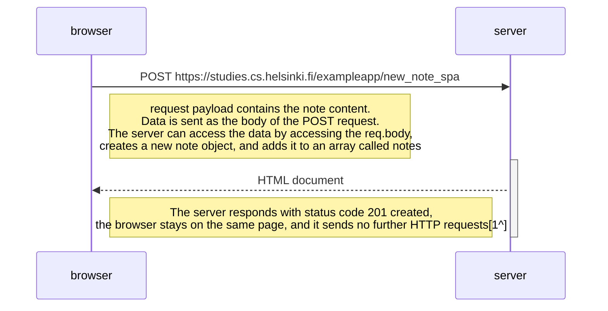

[1^]: **Details:** The server executes the command behind the scenes without requesting a page reload JavaScript activates a method of adding an element to the page as part of a response to a click on the save control/element on the page
   

