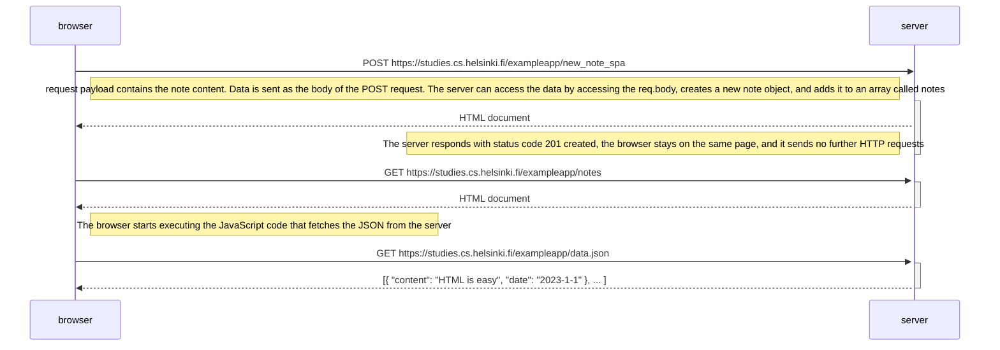

```mermaid
sequenceDiagram

    participant browser
    participant server

    browser->>server: POST https://studies.cs.helsinki.fi/exampleapp/new_note_spa
    activate server
    Note right of browser: request payload contains the note content. Data is sent as the body of the POST request. The server can access the data by accessing the req.body, creates a new note object, and adds it to an array called notes
    activate server
    server-->>browser: HTML document
      Note left of server: The server responds with status code 201 created, the browser stays on the same page, and it sends no further HTTP requests
    deactivate server


    browser->>server: GET https://studies.cs.helsinki.fi/exampleapp/notes
    activate server
    server-->>browser: HTML document
    deactivate server

    Note right of browser: The browser starts executing the JavaScript code that fetches the JSON from the server

    browser->>server: GET https://studies.cs.helsinki.fi/exampleapp/data.json
    activate server
    server-->>browser: [{ "content": "HTML is easy", "date": "2023-1-1" }, ... ]
    deactivate server
```

